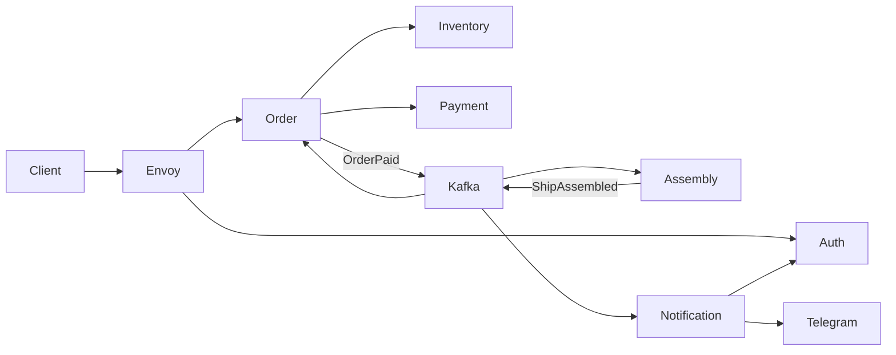

# Go gRPC microservices

[](https://github.com/jefrryss/go-grpc-microservices/actions/workflows/coverage.yml)

Учебный проект курса «Микросервисы, как в BigTech 2.0». Реализованы задания с 1-й по 8-ю неделю: синхронные gRPC-сервисы, PostgreSQL и MongoDB, Kafka, авторизация, уведомления, Envoy и observability.

## Архитектура



| Компонент | Назначение | Хранилище |
| --- | --- | --- |
| InventoryService | Каталог и остатки деталей | MongoDB |
| OrderService | Создание, оплата и статусы заказов | PostgreSQL |
| PaymentService | Проведение учебной транзакции | — |
| AssemblyService | Асинхронная сборка за случайные 1–10 секунд | Kafka |
| AuthService | Регистрация, вход, профили и сессии на 24 часа | PostgreSQL + Redis |
| NotificationService | Уведомления по `OrderPaid` и `ShipAssembled` | Kafka + Telegram |
| Envoy | Единая HTTP-точка входа и проверка сессии | — |

Общий модуль `platform` содержит Zap-логгер, graceful shutdown, health checks, мигратор, Kafka producer/consumer и middleware, Prometheus и OpenTelemetry. Контракты и события находятся в `shared`.

## Что реализовано по неделям

- Неделя 4: env-конфигурация, самописный DI, gRPC health checks, Testcontainers для PostgreSQL и MongoDB, integration job в CI.
- Неделя 5: Kafka в KRaft-режиме, события `OrderPaid` и `ShipAssembled`, AssemblyService, обновление заказа до `ASSEMBLED`.
- Неделя 6: AuthService, bcrypt, PostgreSQL-миграции, Redis-сессии с TTL 24 часа, gRPC auth middleware.
- Неделя 7: Envoy с `ext_authz`, NotificationService, запрос `AuthService.GetUser`, Telegram и команда `/start`.
- Неделя 8: JSON-логи и ELK, Prometheus/Grafana, Telegram-алерт при более чем 10 заказах в минуту, Jaeger и трейс Order → Payment.

## Запуск

Нужны Go 1.25.1+, Docker Desktop и [Task](https://taskfile.dev/). Для полного стека желательно выделить Docker не менее 6 ГБ памяти из-за ELK.

```bash
cp deploy/env/.env.example deploy/env/.env
```

Перед запуском замените в `deploy/env/.env`:

- `TELEGRAM_BOT_TOKEN` — токен от BotFather;
- `TELEGRAM_ALERT_CHAT_ID` — числовой ID чата для Alertmanager;
- пароли PostgreSQL, Redis и Grafana.

Запуск всех баз, сервисов, Kafka, Envoy и observability:

```bash
task up
```

Остановка без удаления данных:

```bash
task down
```

Полезные команды:

```bash
task ps
task logs SERVICE=order_service
task seed-inventory
task restart
task smoke
```

Inventory seed идемпотентен: повторный запуск обновляет товары через `upsert`, не создавая дубликаты.

## Адреса

| Интерфейс | URL |
| --- | --- |
| Envoy API и документация | http://localhost:8088/docs |
| OrderService напрямую | http://localhost:8080/docs |
| Kafka UI | http://localhost:8090 |
| Prometheus | http://localhost:9090 |
| Grafana | http://localhost:3000 |
| Alertmanager | http://localhost:9093 |
| Jaeger | http://localhost:16686 |
| Kibana | http://localhost:5601 |
| Elasticsearch | http://localhost:9200 |
| Envoy admin | http://localhost:9901 |

## Проверка API

Register и Login публичны. Остальные HTTP-запросы через Envoy требуют заголовок `session-uuid` или `Authorization: Bearer <session_uuid>`.

Регистрация пользователя с Telegram-каналом:

```bash
curl -s http://localhost:8088/api/v1/auth/register \
  -H 'content-type: application/json' \
  -d '{
    "login": "demo",
    "password": "secret",
    "email": "demo@example.com",
    "notificationMethods": [
      {"providerName": "telegram", "target": "YOUR_CHAT_ID"}
    ]
  }'
```

Вход:

```bash
curl -s http://localhost:8088/api/v1/auth/login \
  -H 'content-type: application/json' \
  -d '{"login":"demo","password":"secret"}'
```

Сохраните `userUuid` из Register и `sessionUuid` из Login. Получить товары можно через gRPC:

```bash
grpcurl -plaintext -d '{"filter":{}}' \
  localhost:50052 inventory.v1.InventoryService/ListParts
```

Создание заказа:

```bash
curl -s http://localhost:8088/api/v1/orders \
  -H 'content-type: application/json' \
  -H 'session-uuid: SESSION_UUID' \
  -d '{"user_uuid":"USER_UUID","part_uuids":["PART_UUID"]}'
```

Оплата:

```bash
curl -s -X POST http://localhost:8088/api/v1/orders/ORDER_UUID/pay \
  -H 'content-type: application/json' \
  -H 'session-uuid: SESSION_UUID' \
  -d '{"payment_method":"PAYMENT_METHOD_CARD"}'
```

После оплаты OrderService публикует событие, AssemblyService собирает заказ за 1–10 секунд, а итоговый статус становится `ASSEMBLED`. События видны в Kafka UI, уведомления приходят в Telegram, а трейс оплаты — в Jaeger.

## Тесты и генерация

```bash
task test
task vet
task test-integration
task test-coverage
task coverage:html
task generate
```

Integration-тестам нужен запущенный Docker. Полный e2e-тест намеренно не добавлен; API проверяется приведёнными запросами и `task smoke`.

CI запускает unit-тесты всех модулей, Testcontainers-тесты InventoryService и OrderService, затем пересчитывает coverage badges.

## Покрытие тестами

| Микросервис | Покрытие |
| :--- | :--- |
| **OrderService** |  |
| **InventoryService** |  |
| **PaymentService** |  |

## Конфигурация

Исходные значения хранятся только в локальном `deploy/env/.env`, который исключён из Git. `task env:generate` создаёт `.env` для каждого Compose-проекта и итоговый конфиг Alertmanager. Шаблоны без секретов находятся в `deploy/env` и `deploy/observability`.
