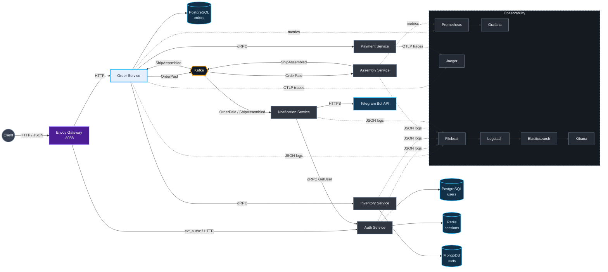

# Go gRPC Microservices

[](https://github.com/jefrryss/go-grpc-microservices/actions/workflows/coverage.yml)

Микросервисная backend-система для каталога комплектующих, оформления заказов, оплаты, сборки и уведомления пользователей.

Внешние HTTP-запросы проходят через Envoy. Внутри системы сервисы общаются по gRPC, а длительные процессы выполняются асинхронно через Kafka. Данные хранятся в PostgreSQL, MongoDB и Redis. Для наблюдения за системой подключены метрики, логи и распределённые трассировки.

## Как работает заказ

1. Пользователь регистрируется и входит через `AuthService`.
2. `AuthService` создаёт сессию в Redis со сроком жизни 24 часа.
3. Клиент получает список доступных комплектующих из `InventoryService`.
4. `OrderService` проверяет товары, рассчитывает стоимость и сохраняет заказ в PostgreSQL.
5. При оплате `OrderService` вызывает `PaymentService` по gRPC.
6. После успешной оплаты в Kafka публикуется событие `OrderPaid`.
7. `AssemblyService` получает событие, выполняет сборку и публикует `ShipAssembled`.
8. `OrderService` переводит заказ в статус `ASSEMBLED`.
9. `NotificationService` получает оба события, запрашивает настройки пользователя в `AuthService` и отправляет уведомления в Telegram.

Статусы заказа: `PENDING_PAYMENT`, `PAID`, `CANCELLED`, `ASSEMBLED`.

## Архитектура



## Сервисы

| Сервис | Ответственность | Внешний интерфейс | Зависимости |
| --- | --- | --- | --- |
| `OrderService` | Создание, получение, оплата и отмена заказов; обработка результата сборки | HTTP `:8080`, gRPC `:50051` | PostgreSQL, Inventory, Payment, Kafka |
| `InventoryService` | Каталог комплектующих, фильтрация и проверка наличия | gRPC `:50052` | MongoDB |
| `PaymentService` | Проведение платежа и генерация `transaction_uuid` | gRPC `:50053` | — |
| `AssemblyService` | Асинхронная сборка заказа за случайные 1–10 секунд | Kafka, metrics `:8085` | Kafka |
| `AuthService` | Регистрация, вход, профили пользователей и проверка сессий | HTTP `:8084`, gRPC `:50054` | PostgreSQL, Redis |
| `NotificationService` | Обработка событий заказа и отправка сообщений | Kafka | AuthService, Telegram API |
| `Envoy` | Единая точка входа, маршрутизация и проверка сессии | HTTP `:8088` | AuthService, OrderService |

Модуль `shared` содержит protobuf-контракты, сгенерированный gRPC-код и контракты Kafka-событий. Модуль `platform` содержит переиспользуемые компоненты: логгер, graceful shutdown, health checks, Kafka-клиенты, мигратор, метрики и трассировку.

## Что реализовано

- REST API поверх gRPC с помощью gRPC-Gateway и OpenAPI.
- Слоистая структура `API → Service → Repository/Client` и ручная dependency injection.
- gRPC health checks и корректное завершение работы сервисов.
- PostgreSQL через `pgxpool`, SQL-миграции через Goose.
- MongoDB-репозиторий с индексами и идемпотентным наполнением каталога через `upsert`.
- Redis-сессии с TTL 24 часа и bcrypt-хеширование паролей.
- Kafka в режиме KRaft без ZooKeeper.
- События `OrderPaid` и `ShipAssembled`, отдельные consumer groups и повторная обработка сообщений при ошибках.
- Envoy `ext_authz`: `Register` и `Login` публичны, остальные HTTP-маршруты требуют действующую сессию.
- Telegram-уведомления и обработка команды `/start`.
- Структурированные JSON-логи через Zap.
- Prometheus-метрики, Grafana dashboard и Alertmanager.
- Telegram-алерт, если за минуту создано более 10 заказов.
- Распределённый OpenTelemetry trace для цепочки `HTTP → OrderService → gRPC → PaymentService`.
- Сбор логов по цепочке `stdout → Filebeat → Logstash → Elasticsearch → Kibana`.
- Unit-тесты, integration-тесты с Testcontainers и автоматический пересчёт покрытия в GitHub Actions.
- Многоэтапные Dockerfile, непривилегированный пользователь в контейнерах и раздельные Docker Compose-конфигурации.

## Технологии и зачем они используются

| Технология | Для чего используется |
| --- | --- |
| Go | Реализация сервисов, клиентов, фоновых обработчиков и платформенных компонентов |
| Protocol Buffers + gRPC | Типизированные контракты и быстрое внутреннее взаимодействие сервисов |
| gRPC-Gateway + OpenAPI | HTTP API и Swagger UI без дублирования транспортных моделей |
| PostgreSQL + pgxpool | Надёжное хранение заказов и пользователей с пулом соединений |
| Goose | Версионирование и автоматическое применение SQL-миграций |
| MongoDB | Хранение каталога комплектующих с гибкими полями и фильтрами |
| Redis | Быстрое хранение пользовательских сессий с автоматическим TTL |
| Kafka | Асинхронная доставка событий между Order, Assembly и Notification |
| Envoy | Единый gateway, маршрутизация запросов и централизованная авторизация |
| Zap | Быстрые структурированные логи в JSON |
| Prometheus + Grafana | Сбор метрик и отображение состояния системы |
| Alertmanager | Контроль частоты создания заказов и отправка алертов |
| OpenTelemetry + Jaeger | Связывание вызовов нескольких сервисов в один trace |
| Elasticsearch + Logstash + Kibana | Централизованный поиск и просмотр логов |
| Docker Compose | Локальный запуск всей системы одной командой |
| Testcontainers | Integration-тесты на настоящих PostgreSQL и MongoDB |

## Структура репозитория

```text
.
├── AssemblyService/
├── AuthService/
├── InventoryService/
├── NotificationService/
├── OrderService/
├── PaymentService/
├── platform/                 # общие инфраструктурные компоненты
├── shared/                   # protobuf-контракты и события
├── deploy/
│   ├── compose/              # Compose-файлы сервисов и инфраструктуры
│   ├── env/                  # шаблоны переменных окружения
│   ├── envoy/                # конфигурация gateway
│   └── observability/        # Prometheus, Grafana, ELK и Alertmanager
├── Taskfile.yml
└── go.work
```

## Быстрый запуск

Понадобятся:

- Go 1.25.1 или новее;
- Docker Desktop;
- [Task](https://taskfile.dev/);
- `envsubst` для генерации конфигурации из шаблонов.

Полный стек с ELK требует примерно 6 ГБ доступной Docker-памяти.

Создайте локальную конфигурацию:

```bash
cp deploy/env/.env.example deploy/env/.env
```

Затем измените в `deploy/env/.env`:

- пароли PostgreSQL и Redis;
- `TELEGRAM_BOT_TOKEN` — токен Telegram-бота;
- `TELEGRAM_ALERT_CHAT_ID` — числовой ID чата для алертов;
- логин и пароль Grafana при необходимости.

Запустите всю систему:

```bash
task up
```

Команда создаст env-файлы, поднимет сеть, базы данных, Kafka, все сервисы, Envoy и observability-стек.

Остановка без удаления данных:

```bash
task down
```

Другие команды:

```bash
task ps                              # состояние контейнеров
task logs SERVICE=order_service      # логи конкретного контейнера
task restart                         # перезапуск всего стека
task seed-inventory                  # повторный запуск MongoDB seed
task smoke                           # проверка основных HTTP-интерфейсов
task env:generate                    # повторная генерация env-файлов
```

## Порты и интерфейсы

### API и сервисы

| Порт | Компонент | Что можно проверить |
| ---: | --- | --- |
| `8088` | Envoy | Основная точка входа: http://localhost:8088/docs |
| `8080` | OrderService HTTP | API напрямую: http://localhost:8080/docs |
| `50051` | OrderService gRPC | gRPC reflection и health check |
| `50052` | InventoryService gRPC | Получение и фильтрация товаров |
| `50053` | PaymentService gRPC | Проведение платежа |
| `50054` | AuthService gRPC | Register, Login, Whoami и GetUser |
| `8084` | AuthService HTTP | HTTP API авторизации напрямую |
| `8085` | AssemblyService | Prometheus endpoint `/metrics` |

### Хранилища и Kafka

| Порт | Компонент | Назначение |
| ---: | --- | --- |
| `5432` | Order PostgreSQL | База заказов |
| `5433` | Auth PostgreSQL | База пользователей |
| `27017` | MongoDB | Каталог комплектующих |
| `6380` | Redis | Пользовательские сессии |
| `9094` | Kafka | Подключение к брокеру с хоста |
| `8090` | Kafka UI | http://localhost:8090 — топики, сообщения и consumer groups |

### Наблюдаемость

| Порт | Интерфейс | Что смотреть |
| ---: | --- | --- |
| `9090` | [Prometheus](http://localhost:9090) | Targets, метрики и PromQL-запросы |
| `3000` | [Grafana](http://localhost:3000) | Графики заказов, выручки и времени сборки |
| `9093` | [Alertmanager](http://localhost:9093) | Состояние и история алертов |
| `16686` | [Jaeger](http://localhost:16686) | Trace оплаты между OrderService и PaymentService |
| `5601` | [Kibana](http://localhost:5601) | Централизованные JSON-логи сервисов |
| `9200` | [Elasticsearch](http://localhost:9200) | Состояние Elasticsearch и индексы логов |
| `9901` | [Envoy Admin](http://localhost:9901) | Кластеры, маршруты и статистика gateway |

Основные бизнес-метрики:

- `orders_total` — количество созданных заказов;
- `orders_revenue_total` — суммарная выручка оплаченных заказов;
- `assembly_duration_seconds` — длительность сборки заказов.

## Проверка API

### 1. Регистрация

`Register` и `Login` доступны без сессии.

```bash
curl -s http://localhost:8088/api/v1/auth/register \
  -H 'content-type: application/json' \
  -d '{
    "login": "demo",
    "password": "secret",
    "email": "demo@example.com",
    "notificationMethods": [
      {"providerName": "telegram", "target": "YOUR_TELEGRAM_CHAT_ID"}
    ]
  }'
```

Из ответа понадобится `userUuid`.

### 2. Вход

```bash
curl -s http://localhost:8088/api/v1/auth/login \
  -H 'content-type: application/json' \
  -d '{"login":"demo","password":"secret"}'
```

Из ответа понадобится `sessionUuid`. Защищённые запросы принимают один из заголовков:

```text
session-uuid: SESSION_UUID
```

или:

```text
Authorization: Bearer SESSION_UUID
```

### 3. Получение товаров

```bash
./bin/grpcurl -plaintext -d '{"filter":{}}' \
  localhost:50052 inventory.v1.InventoryService/ListParts
```

Каталог наполняется автоматически при запуске. Seed использует `upsert`, поэтому повторный запуск не создаёт дубликаты.

### 4. Создание заказа

Подставьте значения `USER_UUID`, `SESSION_UUID` и `PART_UUID` из предыдущих ответов:

```bash
curl -s http://localhost:8088/api/v1/orders \
  -H 'content-type: application/json' \
  -H 'session-uuid: SESSION_UUID' \
  -d '{"user_uuid":"USER_UUID","part_uuids":["PART_UUID"]}'
```

### 5. Оплата

```bash
curl -s -X POST http://localhost:8088/api/v1/orders/ORDER_UUID/pay \
  -H 'content-type: application/json' \
  -H 'session-uuid: SESSION_UUID' \
  -d '{"payment_method":"PAYMENT_METHOD_CARD"}'
```

После оплаты:

- сообщения `OrderPaid` и `ShipAssembled` можно увидеть в Kafka UI;
- через 1–10 секунд статус заказа станет `ASSEMBLED`;
- Telegram-бот отправит уведомления, если у пользователя настроен метод `telegram`;
- полный trace вызова появится в Jaeger;
- метрики изменятся в Prometheus и Grafana;
- JSON-логи появятся в Kibana.

Получение текущего состояния заказа:

```bash
curl -s http://localhost:8088/api/v1/orders/ORDER_UUID \
  -H 'session-uuid: SESSION_UUID'
```

## Тесты и качество кода

```bash
task test               # unit-тесты всех Go-модулей
task vet                # статическая проверка Go-кода
task test-integration   # PostgreSQL и MongoDB через Testcontainers
task test-coverage      # отчёт покрытия по сервисам
task coverage:html      # HTML-отчёт в coverage/coverage.html
task generate           # проверка proto и повторная генерация кода
```

GitHub Actions запускает тесты для всех модулей, integration-тесты InventoryService и OrderService, после чего пересчитывает проценты покрытия в README.

## Покрытие тестами

| Микросервис | Покрытие |
| :--- | :--- |
| **OrderService** |  |
| **InventoryService** |  |
| **PaymentService** |  |

## Конфигурация и секреты

Локальные значения находятся в `deploy/env/.env` и не добавляются в Git. Файлы в `deploy/env/*.template` содержат шаблоны без секретов. Команда `task env:generate` создаёт отдельный `.env` для каждого Compose-проекта и конфигурацию Alertmanager.

Не добавляйте реальные пароли, Telegram-токены и chat ID в репозиторий.
